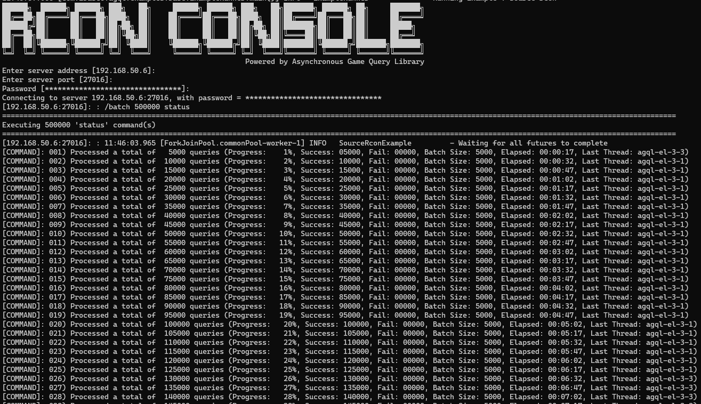

Asynchronous Game Query Library
===============================

[mavenImg]: https://img.shields.io/maven-central/v/com.ibasco.agql/async-gamequery-lib.svg

[mavenLink]: https://search.maven.org/search?q=com.ibasco.agql

[![Maven][mavenImg]][mavenLink] [](https://www.paypal.com/cgi-bin/webscr?cmd=_s-xclick&hosted_button_id=29TX29ZSNXM64) [](https://travis-ci.org/ribasco/async-gamequery-lib) [](https://www.javadoc.io/doc/com.ibasco.agql/async-gamequery-lib) [](https://gitter.im/async-gamequery-lib/lobby?utm_source=share-link&utm_medium=link&utm_campaign=share-link) [](https://www.openhub.net/p/async-gamequery-lib)

A game query library on steroids written for Java. This is an implementation of Valve's source query, rcon, master and steam web api protocols. Built on top of [Netty](https://github.com/netty/netty)

Features
-------------
- Simple and easy to use API
- Powered by [Netty](https://netty.io/). All operations are asynchronous. Every request returns a [CompletableFuture](https://docs.oracle.com/javase/8/docs/api/java/util/concurrent/CompletableFuture.html)
- Fast and memory efficient. Capable of handling multiple transactions at once
    - Netty's off-heap pooled direct byte buffers (Less GC pressure)
    - Thread and connection pooling support. Makes use of netty's event loop (every transaction is run on the same thread).
    - Makes use of native transports if available (e.g. EPOLL, KQueue). Java's NIO is used by default.
- Flexible Configuration support. Clients can be tweaked depending on your requirements (e.g. providing a custom executor, adjusting rate limits etc)
- [Failsafe](https://failsafe.dev/) Integration
    - Retry Policy: A failed transaction is re-attempted until a response is received or it has reached the maximum number of attempts. This is convenient in cases where a connection is dropped by the server due to it changing level etc.
    - Rate Limiter: This prevents overloading the servers by sending requests too fast causing the requests to timeout due to rate limits being exceeded.

Sample Usage
-------------

Synchronous method

```java
//query client
ExecutorService customExecutor = Executors.newCachedThreadPool();
// - Change rate limiting method to BURST
// - Used a custom executor for query client. We are responsible for shutting down this executor, not the library.
Options queryOptions = OptionBuilder.newBuilder()
                                    .option(SourceQueryOptions.FAILSAFE_RATELIMIT_TYPE, RateLimitType.BURST)
                                    .option(TransportOptions.THREAD_EXECUTOR_SERVICE, customExecutor)
                                    .build();
try (SourceQueryClient client = new SourceQueryClient(queryOptions)) {
    InetSocketAddress address = new InetSocketAddress("192.168.60.1", 27016);
    SourceServer info = client.getServerInfo(address).join();
    System.out.printf("INFO: %s\n", info);
}
```

Asynchronous method. Composing all queries (info, players and rules) in one single call. Refer to the documentation for more information.

```java
ExecutorService customExecutor = Executors.newCachedThreadPool();

// - Enabled rate limiting so we don't send too fast
// - Change rate limiting type to SMOOTH
// - Used a custom executor for query client. We are responsible for shutting down this executor, not the library.
Options queryOptions = OptionBuilder.newBuilder()
                                    .option(SourceQueryOptions.FAILSAFE_RATELIMIT_TYPE, RateLimitType.SMOOTH)
                                    .option(TransportOptions.THREAD_EXECUTOR_SERVICE, customExecutor)
                                    .build();
        
SourceQueryClient client = new SourceQueryClient(queryOptions);

SourceQueryAggregate result = new SourceQueryAggregate(address);

CompletableFuture<SourceQueryAggregate> resultFuture = CompletableFuture.completedFuture(result)
                        .thenCombine(queryClient.getServerInfo(address).handle(result.ofType(SourceQueryType.INFO)), Functions::selectFirst)
                        .thenCombine(queryClient.getPlayers(address).handle(result.ofType(SourceQueryType.PLAYERS)), Functions::selectFirst)
                        .thenCombine(queryClient.getServerRules(address).handle(result.ofType(SourceQueryType.RULES)), Functions::selectFirst);

resultFuture.whenComplete(new BiConsumer<SourceQueryAggregate, Throwable>() {
    @Override
    public void accept(SourceQueryAggregate result, Throwable error) {
        if (error != null) {
            throw new CompletionException(error);
        }
        log.info("INFO: {}, PLAYERS: {}, RULES: {}", result.getInfo(), result.getPlayers(), result.getRules());
    }
});
```

RCON Demo Application

 The following image shows the rcon demo executing `500,000k` requests without errors (Specs: Intel i5 3.2Ghz processor, 8Gb ram, Ubuntu Linux OS).



Project Resources
-------------

* [Java API Docs](https://ribasco.github.io/async-gamequery-lib/apidocs)
* [Project Documentation](https://ribasco.github.io/async-gamequery-lib/)
* [Continuous Integration](https://github.com/ribasco/async-gamequery-lib/actions)
* [Snapshot Builds](https://oss.sonatype.org/content/repositories/snapshots/com/ibasco/agql/)

Discussion Platforms
-----------------

If you have any inquiries,concerns or suggestions please use one of the official communication channels for this project

* [Project Issue Tracker](https://github.com/ribasco/async-gamequery-lib/issues/new) (For bug reports/issues please use this)
* [Gitter IM](https://gitter.im/async-gamequery-lib/lobby?utm_source=share-link&utm_medium=link&utm_campaign=share-link)

Implementations
----------------

Below is the list of what is currently implemented on the library

* Valve Master Server Query Protocol
* Valve Source Query Protocol
* Valve Steam Web API
* Valve Steam StoreFront Web API
* Valve Dota 2 Web API
* Valve CS:GO Web API
* Valve Source Log Handler (a log monitor service)
* Supercell Clash of Clans Web API (Deprecated)

Requirements
------------

* Java JDK 8 or above

Installation
------------

Just add the following dependencies to your maven pom.xml. Only include the modules you need.

### Install from Maven Central

**Aggregate (All modules included in this artifact)**

```xml

<dependency>
    <groupId>com.ibasco.agql</groupId>
    <artifactId>agql</artifactId>
    <version>0.2.0</version>
</dependency>
```

**Valve Master Server Query Protocol**

```xml

<dependency>
    <groupId>com.ibasco.agql</groupId>
    <artifactId>agql-steam-master</artifactId>
    <version>0.2.0</version>
</dependency>
```

**Valve Source Query Protocol**

```xml

<dependency>
    <groupId>com.ibasco.agql</groupId>
    <artifactId>agql-source-query</artifactId>
    <version>0.2.0</version>
</dependency>
```

**Valve Steam Web API**

```xml

<dependency>
    <groupId>com.ibasco.agql</groupId>
    <artifactId>agql-steam-webapi</artifactId>
    <version>0.2.0</version>
</dependency>
```

**Valve Dota 2 Web API**

```xml

<dependency>
    <groupId>com.ibasco.agql</groupId>
    <artifactId>agql-dota2-webapi</artifactId>
    <version>0.2.0</version>
</dependency>
```

**Valve CS:GO Web API**

```xml

<dependency>
    <groupId>com.ibasco.agql</groupId>
    <artifactId>agql-csgo-webapi</artifactId>
    <version>0.2.0</version>
</dependency>
```

**Supercell Clash of Clans Web API (Deprecated)**

> **NOTE**: As of 0.2.0, this has been marked as deprecated and will be removed in the next major release

```xml

<dependency>
    <groupId>com.ibasco.agql</groupId>
    <artifactId>agql-coc-webapi</artifactId>
    <version>0.2.0</version>
</dependency>
```

### Install from Source

Clone from remote repository then `mvn install`. All of the modules will be installed to your local maven repository.

~~~bash
git clone https://github.com/ribasco/async-gamequery-lib.git
cd async-gamequery-lib
mvn install
~~~

Usage
------------

For usage examples, please refer to the [site docs](http://ribasco.github.io/async-gamequery-lib/).

Interactive Examples
--------------------

#### RCON interactive example video

The video below demonstrates the following:

- Executing 1000-5000 random commands asynchronously
- Connections are pooled and created on-demand. Max of 8 connection where each connection is automatically authenticated with the remote server.
- Executing a command immediately after issuing a `changelevel` command does not result in failure.

https://user-images.githubusercontent.com/13303385/160422666-7314a89a-a68a-4b92-82ea-5734c4b075e2.mp4

To run the available examples, I have included a convenience script (`run-example.sh`) that will allow you to pick a specific example you want to run.

The script accepts a "key" that represents an example application. To get a list of keys, simply invoke the script without arguments, for example:

~~~bash
raffy@spinmetal:~/projects/async-gamequery-lib$ ./run-example.sh
Error: Missing Example Key. Please specify the example key. (e.g. source-query)

====================================================================
List of available examples
====================================================================
- Source Server Query Example      (key: source-query)
- Master Server Query Example      (key: master-query)
- Source Rcon Example              (key: source-rcon)
- Clash of Clans Web API Example   (key: coc-webapi)
- CS:GO Web API Example            (key: csgo-webapi)
- Steam Web API Example            (key: steam-webapi)
- Steam Storefront Web API Example (key: steam-store-webapi)
- Source Log Listener Example      (key: source-logger)
- Steam Econ Web API Example       (key: steam-econ-webapi)
- Dota2 Web API Example            (key: dota2-webapi)
~~~

If you are running a web service type example, you will be prompted with an API key. Simply copy and paste the key to the console.

~~~
raffy@spinmetal:~/projects/async-gamequery-lib$ ./run-example.sh coc-webapi
Running example for coc-webapi
[INFO] Scanning for projects...
[INFO]
[INFO] ------------------------------------------------------------------------
[INFO] Building AGQL - Examples 0.1.5
[INFO] ------------------------------------------------------------------------
[INFO]
[INFO] --- exec-maven-plugin:1.5.0:java (default-cli) @ agql-lib-examples ---
19:59:25.659 [com.ibasco.agql.examples.base.ExampleRunner.main()] INFO  com.ibasco.agql.examples.base.ExampleRunner - Running Example : coc-webapi
Please input your API Token:
~~~

**Note:**

* Don't forget to perform a `mvn clean install` before running an example
* The output can be reviewed from the `logs` directory under the project's directory.

Protocol Specifications
-----------------------

References you might find helpful regarding the implementations

* [Valve Source RCON Protocol](https://developer.valvesoftware.com/wiki/Source_RCON_Protocol)
* [Valve Master Server Query Protocol](https://developer.valvesoftware.com/wiki/Master_Server_Query_Protocol)
* [Valve Source Query Protocol](https://developer.valvesoftware.com/wiki/Server_queries)
* [Valve TF2 Web API Wiki](https://wiki.teamfortress.com/wiki/WebAPI)
* [Valve Steam Web API](https://developer.valvesoftware.com/wiki/Steam_Web_API)
* [Valve Steam Storefront API](https://wiki.teamfortress.com/wiki/User:RJackson/StorefrontAPI)
* [Clash of Clans Web API](https://developer.clashofclans.com/#/documentation)
* [xPaw Steam Web API Documentation](https://lab.xpaw.me/steam_api_documentation.html)

Contributing
------------

Fork it and submit a pull request. Any type of contributions are welcome.

Special Thanks/Sponsors
------------------------

* ej Technologies - Developer of the award-winning JProfiler, a full-featured "All-in-one" Java Profiler. Click on the icon below to find out more.

  [](http://www.ej-technologies.com/products/jprofiler/overview.html)

* JetBrains - For providing the open-source license for their awesome Java IDE.

  [](https://www.jetbrains.com/idea)
