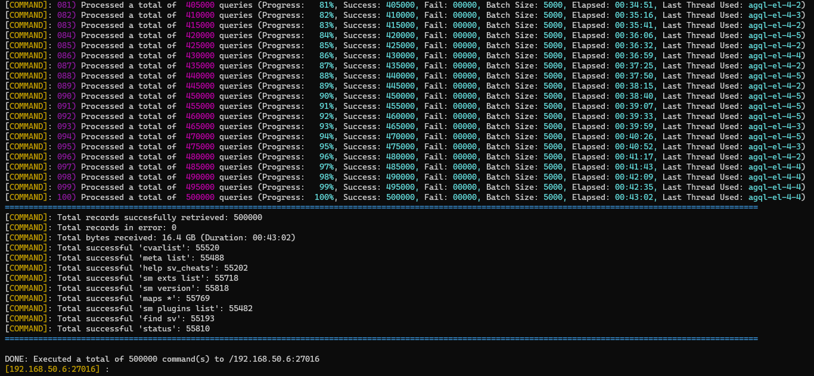

Asynchronous Game Query Library
===============================

[mavenImg]: https://img.shields.io/maven-central/v/com.ibasco.agql/async-gamequery-lib.svg

[mavenLink]: https://search.maven.org/search?q=com.ibasco.agql

[![Maven][mavenImg]][mavenLink] [](https://www.paypal.com/cgi-bin/webscr?cmd=_s-xclick&hosted_button_id=29TX29ZSNXM64) [](https://travis-ci.org/ribasco/async-gamequery-lib) [](https://www.javadoc.io/doc/com.ibasco.agql/async-gamequery-lib) [](https://gitter.im/async-gamequery-lib/lobby?utm_source=share-link&utm_medium=link&utm_campaign=share-link) [](https://www.openhub.net/p/async-gamequery-lib)

A game query library on steroids written for Java. It's an implementation of Valve's source [Query](https://developer.valvesoftware.com/wiki/Server_queries), [Rcon](https://developer.valvesoftware.com/wiki/Source_RCON_Protocol), [Master](https://developer.valvesoftware.com/wiki/Master_Server_Query_Protocol) and [Steam Web API](https://steamcommunity.com/dev) protocols. Built on top of [Netty](https://github.com/netty/netty)

Features
-------------

- Simple and easy to use API.
- All operations are asynchronous. Every request returns a [CompletableFuture](https://docs.oracle.com/javase/8/docs/api/java/util/concurrent/CompletableFuture.html)
- It's fast and capable of handling large transactions.
- Efficient use of system resources
  - Uses netty's off-heap [pooled direct buffers](https://netty.io/wiki/using-as-a-generic-library.html) (Helps reduce GC pressure for high volume/throughput transactions)
  - Built-in thread and connection pooling support. Takes advantage of netty's [event loop](https://netty.io/4.1/api/io/netty/channel/EventLoop.html) model.
  - Makes use of native transports (if available) for increased performance (e.g. [epoll](https://man7.org/linux/man-pages/man7/epoll.7.html), [kqueue](https://developer.apple.com/library/archive/documentation/System/Conceptual/ManPages_iPhoneOS/man2/kqueue.2.html)). Java's NIO is used by default.
- Highly configurable. Clients can be configured to satisfy your requirements (e.g. providing a custom executor, adjusting rate limit parameters, selecting connection pool strategy etc)
- Queries are [Failsafe](https://failsafe.dev/) (excluding web api queries). Some query protocols use UDP as the transport protocol. The problem with UDP is that data is not always guaranteed to be delivered. Resilience [policies](https://failsafe.dev/policies/) have been implemented to guarantee the delivery and receipt of queries. Below are the policies available by default.
  - **Retry Policy:** A failed query is re-attempted until a response has either been received or the maximum number attempts has been reached.
  - **Rate Limiter Policy:** This prevents overloading the servers by sending requests too fast causing the requests to timeout due to rate limits being exceeded.
  - **Circuit Breaker Policy:** When certain number of failures reach the threshold, the library will transition to an "OPEN" state and temporarily reject new requests to prevent overload.

Usage
-------------

For more examples, please refer to the [site docs](http://ribasco.github.io/async-gamequery-lib/).

**Blocking Queries**

```java
public class BlockingQueryExample {

    //Use a custom executor. This is not really necessary as the library 
    //provides it's own default executor, this only serves an example.
    ExecutorService customExecutor = Executors.newCachedThreadPool();

    public static void main(String[] args) {
        // - Change rate limiting method to BURST
      // - Used a custom executor for query client. We are responsible for shutting down this executor, not the library.
      SourceQueryOptions queryOptions = SourceQueryOptions.builder()
                                                          .option(SourceQueryOptions.FAILSAFE_RATELIMIT_TYPE, RateLimitType.BURST)
                                            .option(GlobalOptions.THREAD_EXECUTOR_SERVICE, customExecutor)
                                            .build();

        //You can instantiate the client from the try-with block as it implements the java.io.Closeable interface
        try (SourceQueryClient client = new SourceQueryClient(queryOptions)) {
            InetSocketAddress address = new InetSocketAddress("192.168.60.1", 27016);
            SourceServer info = client.getInfo(address).join();
            System.out.printf("INFO: %s\n", info);
        }
    }
}
```

**Non-Blocking Queries**

```java
import java.util.concurrent.CompletableFuture;
import java.util.concurrent.CountDownLatch;

public class NonBlockingQueryExample {

    //Use a custom executor. This is not required as the library 
    //provides it's own default global executor shared across all clients, this only serves an example on how you can provide your own.
    ExecutorService customExecutor = Executors.newCachedThreadPool();

    public static void main(String[] args) throws Exception {
        //Example configuration
        // - Enabled rate limiting so we don't send too fast
        // - Change rate limiting type to SMOOTH (Two available types SMOOTH and BURST)
      // - Used a custom executor for query client. We are responsible for shutting down this executor, not the library.
      SourceQueryOptions queryOptions = SourceQueryOptions.builder()
                                                          .option(SourceQueryOptions.FAILSAFE_RATELIMIT_TYPE, RateLimitType.SMOOTH)
                                            .option(GlobalOptions.THREAD_EXECUTOR_SERVICE, customExecutor)
                                            .build();

        //create a countdown latch with value of 1 since we are only expecting to receive 1 result
        CountDownLatch latch = new CountDownLatch(1);

        //Instantiate the client (constructor argument is optional)
        try (SourceQueryClient client = new SourceQueryClient(queryOptions)) {
            //Create a user defined object which serves as an aggregate where all the resulting data will be stored
            SourceQueryAggregate result = new SourceQueryAggregate(address);
            CompletableFuture<SourceQueryInfoResponse> infoFuture = client.getInfo(address);

            //Check if the future is complete
            if (infoFuture.isDone()) {
                try {
                    SourceQueryInfoResponse response = infoFuture.getNow(null);
                } catch (Exception e) {
                    e.printStackTrace(System.err);
                } finally {
                    latch.countDown();
                }
            }
            //If not yet done, register a callback and display the result once completed
            else {
                infoFuture.whenComplete(new BiConsumer<SourceQueryInfoResponse, Throwable>() {
                    @Override
                    public void accept(SourceQueryInfoResponse response, Throwable error) {
                        try {
                            if (error != null) {
                                throw new CompletionException(error);
                            }
                            assert response != null;
                            System.out.printf("INFO: %s\n", response.getResult());
                        } finally {
                            latch.countDown();
                        }
                    }
                });
            }

          //REMEMBER: Since we are executing an asynchronous operation, 
          // we need to wait until we have received a response from the server, 
          // otherwise the program might abruptly be terminated. 
          latch.await();
        }
    }
}
```

Here is an advanced example demonstrating how to combine all three queries in one call. For more advanced examples (e.g. sending requests by batch), please check out the [examples](https://github.com/ribasco/async-gamequery-lib/blob/master/examples/src/main/java/com/ibasco/agql/examples/SourceQueryExample.java) module in the project source.

```java
public class NonBlockingQueryExample {

    //Use a custom executor. This is not required as the library 
    //provides it's own default global executor shared across all clients, this only serves an example on how you can provide your own.
    ExecutorService customExecutor = Executors.newCachedThreadPool();

    public static void main(String[] args) {
        //Example configuration
        // - Enabled rate limiting so we don't send too fast
        // - Change rate limiting type to SMOOTH (Two available types SMOOTH and BURST)
      // - Used a custom executor for query client. We are responsible for shutting down this executor, not the library.
      SourceQueryOptions queryOptions = SourceQueryOptions.builder()
                                                          .option(SourceQueryOptions.FAILSAFE_RATELIMIT_TYPE, RateLimitType.SMOOTH)
                                            .option(GlobalOptions.THREAD_EXECUTOR_SERVICE, customExecutor)
                                            .build();
        //Instantiate the client (constructor argument is optional)
        SourceQueryClient client = new SourceQueryClient(queryOptions);

        //Create a user defined object which serves as an aggregate where all the resulting data will be stored
        SourceQueryAggregate result = new SourceQueryAggregate(address);

        //Combining all queries in one call
        //Note: `Functions::selectFirst` is simply a utility function which returns the first argument of the callback 
        CompletableFuture<SourceQueryAggregate> resultFuture = CompletableFuture.completedFuture(result)
                                                                                .thenCombine(client.getInfo(address).handle(result.ofType(SourceQueryType.INFO)), Functions::selectFirst)
                                                                                .thenCombine(client.getPlayers(address).handle(result.ofType(SourceQueryType.PLAYERS)), Functions::selectFirst)
                                                                                .thenCombine(client.getRules(address).handle(result.ofType(SourceQueryType.RULES)), Functions::selectFirst);

        //Display result
        resultFuture.whenComplete(new BiConsumer<SourceQueryAggregate, Throwable>() {
            @Override
            public void accept(SourceQueryAggregate result, Throwable error) {
                if (error != null) {
                    throw new CompletionException(error);
                }
                log.info("INFO: {}, PLAYERS: {}, RULES: {}", result.getInfo(), result.getPlayers(), result.getRules());
            }
        });
    }
}
```

**RCON 500k requests test**

The following image shows the test results after executing `500,000k` random commands on a single server instance (no reported errors).

- Connection pool size: 10
- Thread pool size: 9 threads
- CPU: Intel i5 3.2Ghz
- RAM: 8 Gb
- OS: Ubuntu Linux 20.04
- Transport used: epoll



Project Resources
-------------

* [Java API Docs](https://ribasco.github.io/async-gamequery-lib/apidocs)
* [Project Documentation](https://ribasco.github.io/async-gamequery-lib/)
* [Continuous Integration](https://github.com/ribasco/async-gamequery-lib/actions)
* [Snapshot Builds](https://oss.sonatype.org/content/repositories/snapshots/com/ibasco/agql/)

Discussion Platforms
-----------------

If you have any inquiries,concerns or suggestions please use one of the official communication channels for this project

* [Project Issue Tracker](https://github.com/ribasco/async-gamequery-lib/issues/new) (For bug reports/issues please use this)
* [Gitter IM](https://gitter.im/async-gamequery-lib/lobby?utm_source=share-link&utm_medium=link&utm_campaign=share-link)

Implementations
----------------

Below is the list of what is currently implemented on the library

* Valve Master Server Query Protocol
* Valve Source Query Protocol
* Valve Steam Web API
* Valve Steam StoreFront Web API
* Valve Dota 2 Web API
* Valve CS:GO Web API
* Valve Source Log Service (A service which allows you to recive server log events)
* ~~Supercell Clash of Clans Web API (Deprecated)~~

Requirements
------------

* Java JDK 8 or above

Installation
------------

Just add the following dependencies to your maven pom.xml. Only include the modules you need.

### Install from Maven Central

**Aggregate (All modules included in this artifact)**

```xml
<dependency>
    <groupId>com.ibasco.agql</groupId>
    <artifactId>agql</artifactId>
    <version>1.0.0</version>
</dependency>
```

**Valve Master Server Query Protocol**

```xml
<dependency>
    <groupId>com.ibasco.agql</groupId>
    <artifactId>agql-steam-master</artifactId>
    <version>1.0.0</version>
</dependency>
```

**Valve Source Query Protocol**

```xml
<dependency>
    <groupId>com.ibasco.agql</groupId>
    <artifactId>agql-source-query</artifactId>
    <version>1.0.0</version>
</dependency>
```

**Valve Steam Web API**

```xml
<dependency>
    <groupId>com.ibasco.agql</groupId>
    <artifactId>agql-steam-webapi</artifactId>
    <version>1.0.0</version>
</dependency>
```

**Valve Dota 2 Web API**

```xml
<dependency>
    <groupId>com.ibasco.agql</groupId>
    <artifactId>agql-dota2-webapi</artifactId>
    <version>1.0.0</version>
</dependency>
```

**Valve CS:GO Web API**

```xml
<dependency>
    <groupId>com.ibasco.agql</groupId>
    <artifactId>agql-csgo-webapi</artifactId>
    <version>1.0.0</version>
</dependency>
```

**Supercell Clash of Clans Web API (Deprecated)**

> **NOTE**: As of 1.0.0, this has been marked as deprecated and will be removed in the next major release

```xml
<dependency>
    <groupId>com.ibasco.agql</groupId>
    <artifactId>agql-coc-webapi</artifactId>
    <version>1.0.0</version>
</dependency>
```

### Install from Source

Clone from remote repository then `mvn install`. All of the modules will be installed to your local maven repository.

~~~bash
git clone https://github.com/ribasco/async-gamequery-lib.git
cd async-gamequery-lib
mvn install
~~~

Interactive Examples
--------------------

#### RCON interactive example video

To run the available examples, I have included a convenience script (`run-example.sh` or `run-example.cmd`) that will allow you to pick a specific example you could run.

The script accepts a "key" that represents an example application. To get a list of keys, simply invoke the script without arguments, for example:

~~~bash
$ ./run-example.sh
Error: Missing Example Key. Please specify the example key. (e.g. source-query)

====================================================================
List of available examples
====================================================================
- Source Server Query Example      (key: source-query)
- Master Server Query Example      (key: master-query)
- Source Rcon Example              (key: source-rcon)
- Clash of Clans Web API Example   (key: coc-webapi)
- CS:GO Web API Example            (key: csgo-webapi)
- Steam Web API Example            (key: steam-webapi)
- Steam Storefront Web API Example (key: steam-store-webapi)
- Source Log Listener Example      (key: source-logger)
- Steam Econ Web API Example       (key: steam-econ-webapi)
- Dota2 Web API Example            (key: dota2-webapi)
~~~

If you are running a web service type example, you will be prompted with an API key. Simply copy and paste the key to the console.

~~~bash
$ ./run-example.sh coc-webapi
Running example for coc-webapi
$ Please input your API Token:
~~~

**Note:**

* Don't forget to perform a `mvn clean install` before running an example

Protocol Specifications
-----------------------

References you might find helpful regarding the implementations

* [Valve Source RCON Protocol](https://developer.valvesoftware.com/wiki/Source_RCON_Protocol)
* [Valve Master Server Query Protocol](https://developer.valvesoftware.com/wiki/Master_Server_Query_Protocol)
* [Valve Source Query Protocol](https://developer.valvesoftware.com/wiki/Server_queries)
* [Valve TF2 Web API Wiki](https://wiki.teamfortress.com/wiki/WebAPI)
* [Valve Steam Web API](https://developer.valvesoftware.com/wiki/Steam_Web_API)
* [Valve Steam Storefront API](https://wiki.teamfortress.com/wiki/User:RJackson/StorefrontAPI)
* [Clash of Clans Web API](https://developer.clashofclans.com/#/documentation)
* [xPaw Steam Web API Documentation](https://lab.xpaw.me/steam_api_documentation.html)

Demo Application
----------------
Coming soon

Contributing
------------

Fork it and submit a pull request. Any type of contributions are welcome.

Special Thanks
---------------

* ej Technologies - Developer of the award-winning JProfiler, a full-featured "All-in-one" Java Profiler. Click on the icon below to find out more.

  [](http://www.ej-technologies.com/products/jprofiler/overview.html)

* JetBrains - For providing the open-source license for their awesome Java IDE.

  [](https://www.jetbrains.com/idea)
